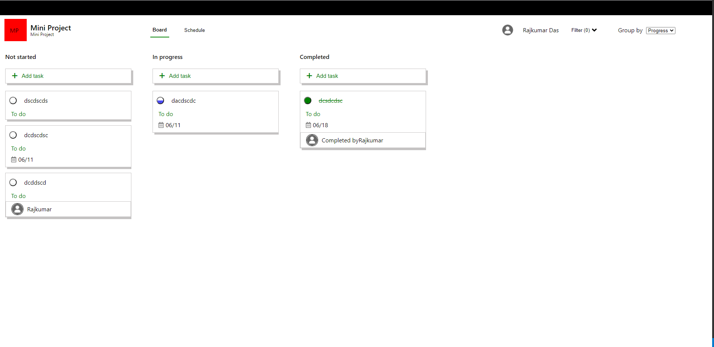
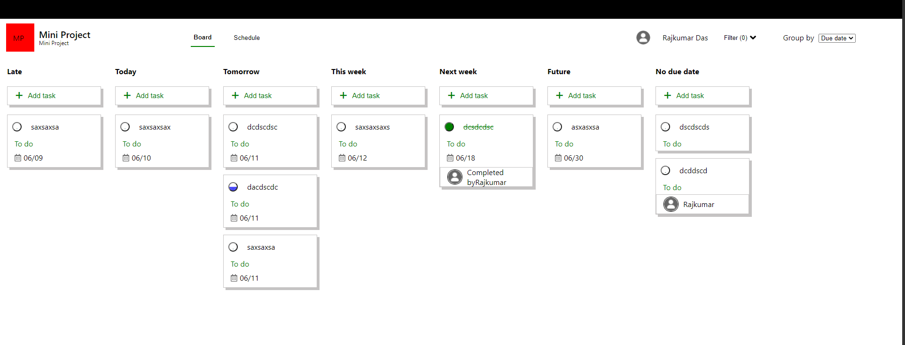
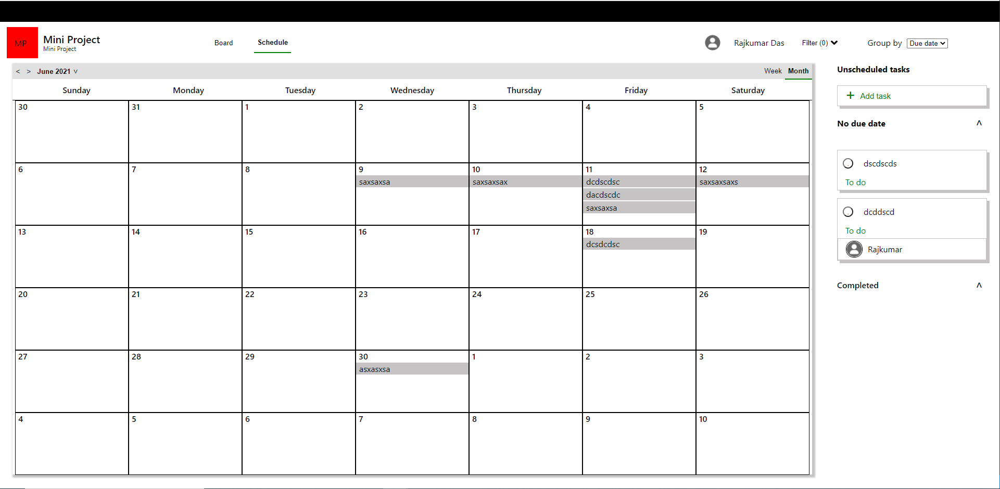

# Clone of Microsoft Planner app

This project is built with React

## Project Description

This app helps you plan your task and assign it to yourself or your team members.
You can filter the task to check if you are late for any, ones that's schedule for today, tomorrow, somewhere in this week, next week, in future or have task with no due date.
I have a schedule (calendar) view where you see task on the dates they were scheduled for. Schedule view also have a column to list task which doesn't have any due date.

In both the views (Board and Schedule), you can group task by progress or due date.

## Built With

- React
- HTML and CSS
- Eslint and Stylelint as linters

## Demo

- [Live version](https://rajda-planner-app.netlify.app/)

## Project Setup

- Fork this GitHub repository
- Clone the repository to your machine
- Run 'npm install' to install the project dependencies
- Run 'npm start' to load the application on your browser
- Above command should open this URL http://localhost:8080/ on your browser.

### `npm start`

Runs the app in the development mode.\
Open [http://localhost:3000](http://localhost:3000) to view it in the browser.

The page will reload if you make edits.\
You will also see any lint errors in the console.

## Authors

👤 **Rajkumar Das**

- Github: [@rajkumardas2701](https://github.com/rajkumardas2701)
- Twitter: [@Rajkuma58621299](https://twitter.com/Rajkuma58621299)
- Linkedin: [Rajkumar Das](https://www.linkedin.com/in/rajkumar-das-41308961/)

## 🤝 Contributing

Contributions, issues and feature requests are welcome!

Feel free to check the [issues page](https://github.com/rajkumardas2701/planner-app/issues).

## Show your support

Give a ⭐️ if you like this project!

## 📝 License

This project is [MIT](lic.url) licensed.